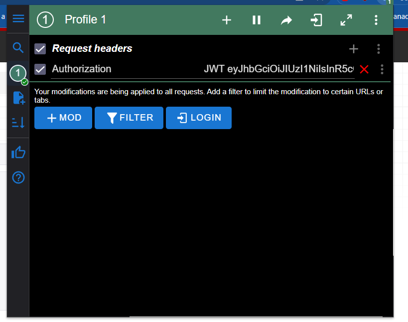

# AUTHENTICATING IN DJANGO-REST-FRAMEWORK BACKEND USING DJOSER

## Apply Token-Based authentication in DRF project using djoser, djangorestframework-simplejwt

Packages to install:
```
    django
    djangorestframework
    djoser
    djangorestframework_simplejwt
```

Start project using command:
```
    django-admin startproject <your_project>
```

In 'your_project.settings.py':
```python
INSTALLED_APPS = [
    ...
    #Register djoser and djangorestframework
    'djoser',
    'rest_framework',
]
```

In 'your_project.urls.py':
```python
urlpatterns = [
    ...
    #Register djoser's urls
    path('auth/', include('djoser.urls')),
    path('auth/', include('djoser.urls.jwt')),
]
```

Add following to 'your_project.settings.py':
```python
REST_FRAMEWORK = {
    'DEFAULT_AUTHENTICATION_CLASSES': (
        'rest_framework_simplejwt.authentication.JWTAuthentication',
    ),
}

SIMPLE_JWT = {
    'AUTH_HEADER_TYPES': ('JWT', ),
    'ACCESS_TOKEN_LIFETIME': timedelta(hours=3)
}
```

Djoser provides the following endpoints:
```
    /users/
    /users/me/
    /users/confirm/
    /users/resend_activation/
    /users/set_password/
    /users/reset_password/
    /users/reset_password_confirm/
    /users/set_username/
    /users/reset_username/
    /users/reset_username_confirm/
    /jwt/create/
    /jwt/refresh/
    /jwt/verify
```

To be recognized as an authenticated generated token should be provided in request header like this:
